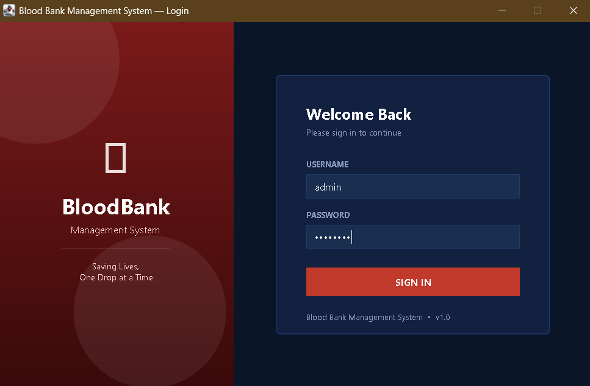
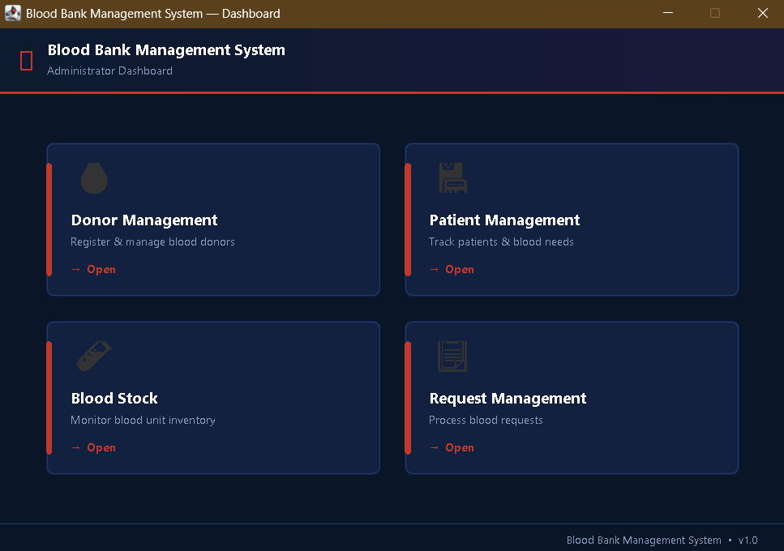
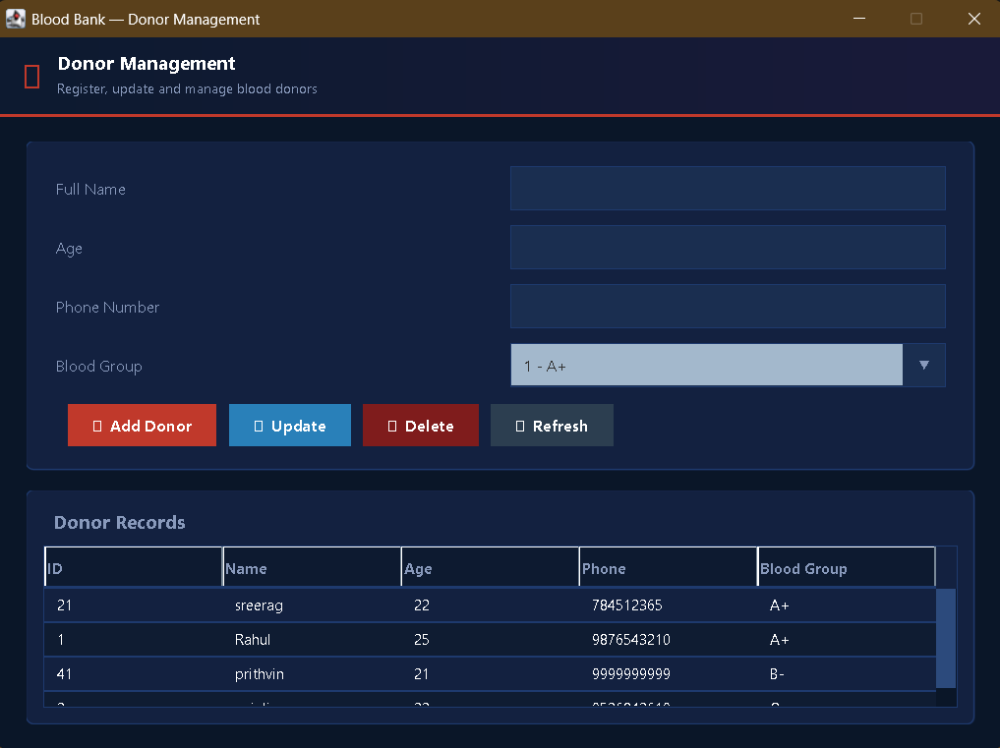
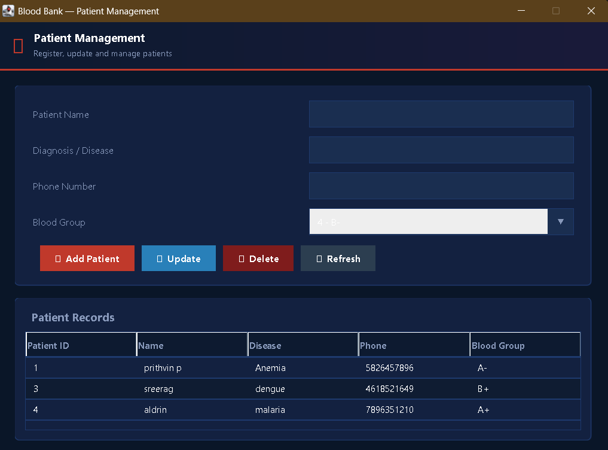
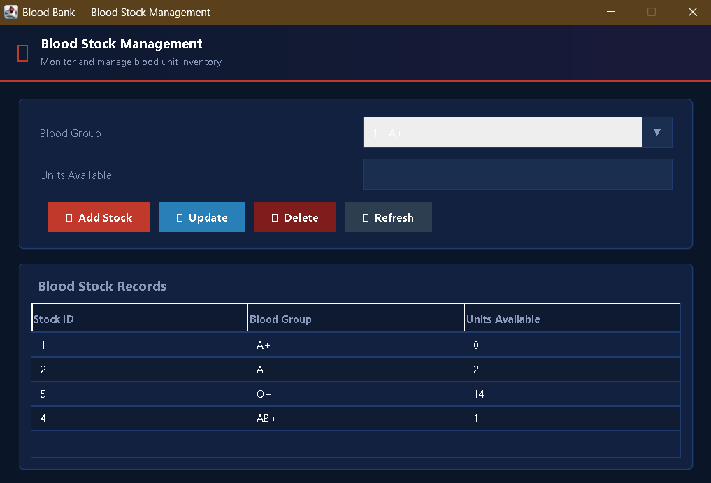
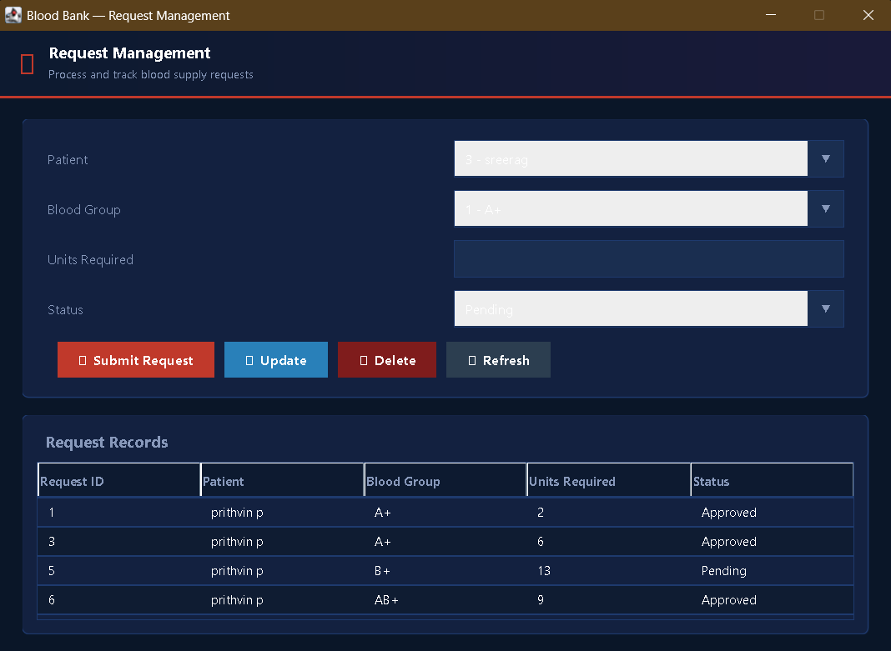

# Blood Bank Management System

> A comprehensive, modern, and beautiful Java Swing application for managing blood bank operations.

## Overview
The Blood Bank Management System is a desktop application developed in Java using Swing for the UI. It provides an elegant, medical-themed interface for managing donors, patients, blood stock, and requests, while connecting to a backend database for reliable data storage.

## Features
- **Modern UI**: Clean layout, consistent padding, modern fonts, soft background colors, and rounded buttons with hover effects.
- **Login Module**: Secure access to the system.
- **Dashboard**: A comprehensive overview of system status.
- **Donor Management**: Add, update, and track blood donors.
- **Patient Management**: Manage patient data and their blood requirements.
- **Blood Stock Management**: Keep track of available blood by group.
- **Blood Requests**: Handle and process requests for blood.
- **Documentation**: Includes a detailed class diagram and documentation (`BloodBankManagementSystem_Documentation.docx`).

## Technologies Used
- **Language**: Java
- **UI Framework**: Java Swing
- **Build Tool**: Maven

## Requirements
- Java Development Kit (JDK) 8 or higher
- Database server (e.g., MySQL) for the backend connection.
- Maven (for managing dependencies and building)

## Getting Started

### 1. Clone the repository
```bash
git clone <repository-url>
```

### 2. Configure Database
Update the database connection settings (URL, username, password) in the database connection class to point to your local database instance.

### 3. Build the Application
Using Maven, build the project to download dependencies and compile the code:
```bash
mvn clean install
```

### 4. Run the Application
Run the main entry point of the application, which is typically the `LoginFrame` class.

## Project Structure
The source code is located in the `src/main/java/` directory. The UI components are organized under `com.bloodbank.bloodbankmanagementsystem.ui`, and the system uses a shared `MedicalTheme.java` utility class for consistent styling across all frames.

## License
[Specify License Here]

## Screenshots

### Login Screen


### Dashboard


### Donor Management


### Patient Management


### Blood Stock


### Request Module

